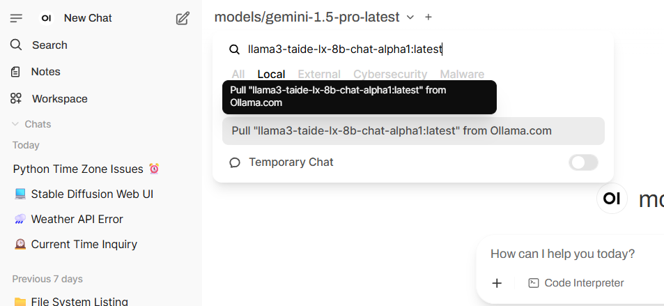

# Open WebUI 使用手冊

Open WebUI 官方使用說明文件：[https://docs.openwebui.com/](https://docs.openwebui.com/)

Open WebUI 社群：[https://openwebui.com/](https://openwebui.com/)

# 目錄

# 1. 下載 Base Model / 連接線上Model

## 1.1 下載 Base Model

### 1.1.1 從 Ollama 下載

網址: [https://ollama.com/](https://ollama.com/) 

進入 Ollama 官方網站，搜尋或瀏覽找到欲下載的模型，並記下模型的 **Name**（識別名稱）

回到 **Open WebUI**，點選 **選取 Models** 處，在搜尋框輸入剛剛紀錄的模型名稱

若該模型尚未下載，會顯示「**Pull "Model" from ollama.com**」，點擊後開始下載

下載完成後，即可直接使用

### 1.1.2 Huggingface

網址: [https://huggingface.co/](https://huggingface.co/)

進入 Hugging Face 官網，搜尋或瀏覽找到欲下載的模型，注意：**必須為 GGUF (GPT-Generated Unified Format)格式**

p.s GGUF 格式是針對輕量化推論與跨平台部署（如 CPU、行動裝置）最佳化

回到 **Open WebUI**，點選 **選取 Models** 處，在搜尋框輸入 `hf.co/+模型名稱`

若尚未下載，會出現「**Pull "Model" from ollama.com**」，點擊後即可下載

下載完成後可直接使用

## 1.2 連接線上Model

若要串接線上模型（如 Gemini, ChatGPT），點擊介面左下角的使用者名稱，會跳出功能選單，在選單中選擇 Admin Panel。

在右邊介面，找到Setting/Connections，可以找到 OpenAI API 下的  Manage OpenAI API Connections ，點選右側的 + 進入設定。

填寫相關資訊：

- URL (API Base URL):
    - Gemini: [https://generativelanguage.googleapis.com/v1beta/openai](https://generativelanguage.googleapis.com/v1beta/openai)
    - ChatGPT: [https://api.openai.com/v1](https://api.openai.com/v1)
- Key (API Key):  填入該 API 的授權金鑰

輸入完成後，點擊 URL 旁邊的「重新整理」圖示，若顯示 Server connection verified，代表已成功連線。

點選 **選取 Models** 處，選擇 External 的 tag，即可看到透過 URL 成功掛載的模型列表。點選對應模型後，即可載入使用。

# 2. Workspace 相關設定

點選左側面板的 Workspace，右側將顯示 Models、Knowledge、Prompts、Tools 等相關設定選項，便於管理與自定義。以下將針對各項設定進一步說明。

## 2.1 Models

此處 Models 指的是設定過後的Custom Models，並非原始的Base Model。

透過自定義模型，使用者可以針對不同情境或需求，設定專屬的模型行為與特性。

若要新增自定義模型，可點擊右上角的「＋」 圖示進行建立。

### 2.1.1  建立Custom Model

建立或編輯一個 Custom  Models 的設定頁面，主要包含：

- Model Name：設定模型的名稱
- Base Model (From)：選擇基礎的 GPT 模型，如 gemma3:latest 等
- Description：填寫此模型的簡短描述
- Tags (建議設定)：可加上標籤方便快速檢索到 Model
- Visibility：設定模型的可見性（Private / Public）
- Groups：指定哪些群組可使用此模型
- System Prompt：定義模型的行為指令，如：
    - 你是一位資安事件分析師，專責於針對各類資安事件進行判斷、初步溯源、並給予應對建議
    - 請用繁體中文呈現，當知識庫找不到資訊時，回覆使用者:「找不到相關內容」，不多加額外內容
- Advanced Params：可調整進階參數，如：
    - 創意度 vs 精準度：Temperature 、top_p、top_k
    - 長度與結構：max_tokens、Stop Sequence
    - 避免重複：frequency_penalty / presence_penalty / repeat_penalty / repeat_last_n
    - 特殊應用：Function Calling
- Prompt Suggestions：設定建議輸入提示詞
- Knowledge：是否連結自有知識庫。

## 2.2 Knowledge

透過匯入資料，可建立與管理知識庫，使模型具備指定領域的專業知識，進一步提升回答的準確性。此功能適合應用於特定文件、FAQ、技術手冊等資料的整合與查詢。

若要新增知識庫，可點擊右上角的「＋」 圖示進行建立。

### 2.2.1 建立 **knowledge base**

建立 knowledge base ****的設定，主要包含：

- What are you working on?: 填寫知識庫名稱，方便辨識用途
- What are you trying to achieve?: 描述此知識庫的目標與內容摘要，協助管理與辨識
- Visibility：設定模型的可見性（Private / Public）
- Groups：指定哪些群組可使用此模型

建立後，可以將文件、PDF 或文字上傳，並在對話時引入相關資料做為參考。

上傳資料後，知識庫內會顯示已上傳的檔案，系統會自動解析並建立索引，便於後續模型在對話時引用相關資料作為回答的依據。

若要檢視上傳的內容，可以直接點擊檔案名稱，介面會顯示該檔案的文字內容。

## 2.3 Prompts

透過自定義 Prompt，Prompt 是用來定義模型的角色、對話風格、專業領域或回答邏輯的設定檔，設計符合業務或應用場景的對話模版，方便於對話時快速呼叫並使用。

若要新增 Prompt，可點擊右上角的「＋」 圖示進行建立。

建立 Prompt ****的設定，主要包含：

- Title: 描述此 Prompt 的用途
- Prompt Content: 撰寫該角色的行為指引、工作任務與回應格式等
    - 在編寫 Prompt Content 時，可以透過變數設計，讓模型在回應時能動態插入內容，提升靈活性與重用性。變數的格式為：{{變數名稱}}，務必使用雙層大括號 {{ }} 包覆。
        - 例如：{{CVE Description}}，讓模型知道這個位置會被替換成實際的 CVE 描述。
    - 可用來自動帶入當前剪貼簿的文字內容，適合搭配系統快捷操作，直接將剪下或複製的資料餵給模型處理。
        
        
        

## 2.4 Tools(待研究 …)

# 3. 管理員控制台(待研究 …)

# 4. 常用功能

## 4.1 新增對話

對話開啟時，右上方可選擇要使用的模型。

- Base Model：選擇下載過的本地或串接的線上模型。
- Custom Model：選擇在 WorkSpace 調整過的自訂義模型。

## 4.2 引入參考資料 (Knowledge)

在對話中輸入 **#**，系統會顯示可選擇的參考來源，包含：

- **COLLECTION** ：一組資料集，內含多個檔案。
- **FILE**：單一檔案，快速針對特定文件進行引用。

選擇後，模型即可在回答時參考這些資料內容。

注意：可同時選擇多個參考來源！

選擇想要參考的資料，對話框上方會顯示「已選擇的參考資料」。

## 4.3  引入常用 Prompts

在對話中輸入 /，會自動呼叫出已建立的 Prompt 列表

選擇想要的 Prompt後，若有在 Prompt 中設定變數，會自動反白方便貼上複製的資訊

# 5. 待研究 …

- Tools功能
    - 建立和使用
    - 裡面程式撰寫方式
    - 如何直接使用社群已撰寫好的
- 新增 Hugging Face 模型轉換為 GGUF 格式 (目前僅可從 Hugging Face 下載 GGUF 格式模型)：
說明如何透過圖形化介面（GUI）將 Hugging Face 上的模型轉換成 GGUF 格式，無需撰寫指令，即可完成轉換流程。
- 程式範本：透過程式碼直接呼叫模型（不經由 UI 操作）
- 管理員控制台
    - Users
    - Functions
    - Settings
        - Documents
- 目前 OLLAMA 僅支援一次跟一個model互動
    - 可能可以研究是否可以併行處理
    - 或再串接其他顯卡